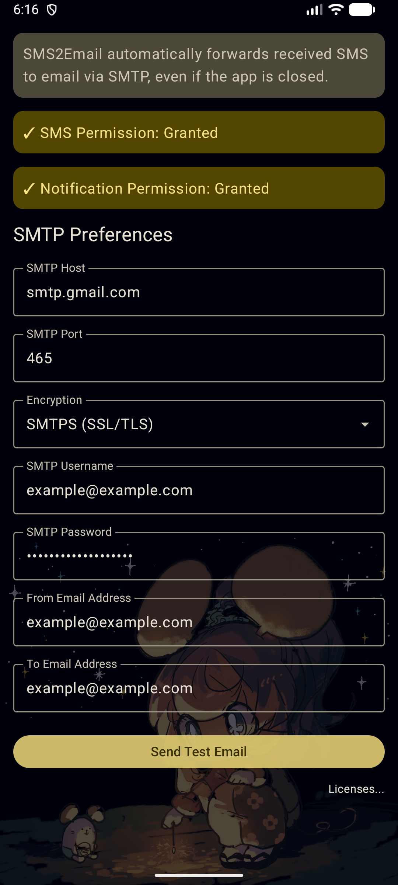
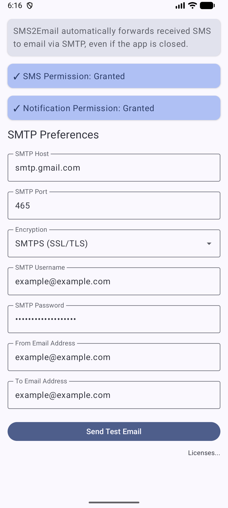

# SMS2Email

An Android application that forwards incoming SMS messages to a specified email address.

This app is useful for users who need to access their SMS messages remotely.

| 🌙                                                                        | ☀️                                                                         |
| ------------------------------------------------------------------------- | -------------------------------------------------------------------------- |
|  |  |

